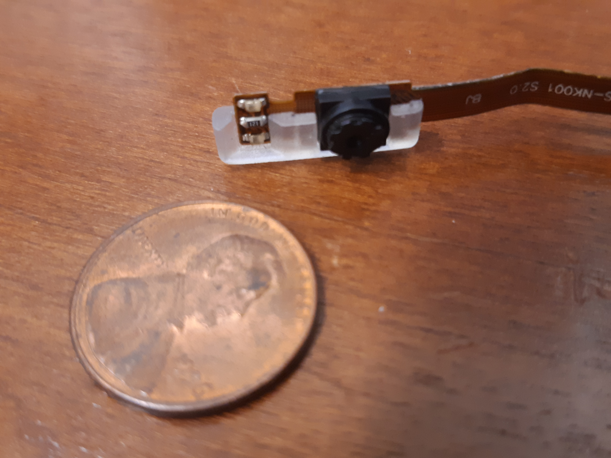
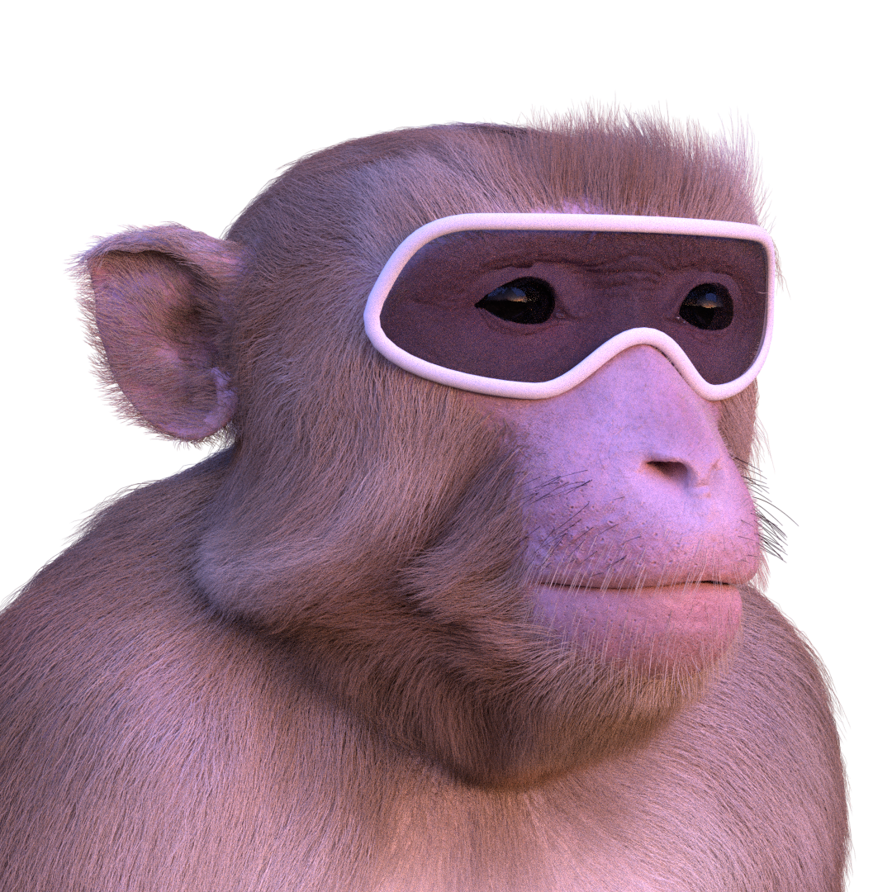

====================================================================
METHVEX - Monkey Eye Tracking for Head-free Visual Experiments
====================================================================

Neuroscientists are increasingly interested in studying brains in the contexts they evolved to process, which requires greater ethological validity of experimental designs.
To take advantage of paradigms involving immersive environments including
large enclosures and virtual-reality dome projections, it is desirable to record the subject's eye position (in head-centered coordinates) in head-free animals.
This poses several technical challenges:

1) The head-mounted video eye-tracking apparatus must be sufficiently light and robust for extended use by chaired animals.

2) The frames that hold the polarizing filters of the 3D glasses and the eye cameras in front of the eyes must minimize the portion of the visual field that they occluded. 

3) Head direction signals (in world-centered coordinates) must be integrated with eye direction signals (in head-centered coordinates) in order to compute gaze direction in world-centered coordinates online.

1) `PupilLabs <https://pupil-labs.com/>`_: A light-weight head-mounted eye tracker
===================================================================================

Many of the commercial video eye-tracking cameras intended to be head-mounted on human subjects are relatively large and heavy, thus obstructing the visual field and
putting strain on the wearer. The open-source system from `Pupil Labs <https://pupil-labs.com/>`_ utilizes some of the smallest and lightest cameras available. Many
of the camera specs are comparable to those of the industry standards (such as `SR Research's EyeLink <>`_) (see below and `here <https://doi.org/10.1101/536243>`__ for a more in depth comparison of performance), but the hardware are substantially smaller
and lighter. This allows them to be discretely mounted below the eye
with a direct line of sight - thus avoiding the need for cumbersome and
delicate hot mirrors, while still minimizing occlusion of the subject's
visual field.

+--------------------+------------------------+------------+
|                    | SR Research EyeLink II | Pupil Labs |
+====================+========================+============+
| Sampling frequency | 500 Hz                 | 200 Hz     |
+--------------------+------------------------+------------+
| Gaze accuracy      | 0.5 deg                | 0.6 deg    |
+--------------------+------------------------+------------+
| Gaze precision     | 0.01 deg               | 0.08 deg   |
+--------------------+------------------------+------------+
| Camera Latency     | 3 ms                   | 4.5 ms     |
+--------------------+------------------------+------------+
| Weight             | XXX g                  | 32 g       |
+--------------------+------------------------+------------+
| Cost               | $20,000                | $2,000     |
+--------------------+------------------------+------------+

The eye cameras are very small and can be easily removed from the black
3D-printed casing provided by PupilLabs for human head-mounted use.
Instead, we designed a lower-profile camera casing to integrate with the
3D glasses frames that the macaque subjects wear, as seen in the photos
below.

2) 3D glasses frames for macaques
==================================

To minimize occlusion of the subject's field of view (FOV), we
designed a pair of spectacle frames to closely fit the contours of the
face of an average Rhesus macaque (see computer renders below). The wrap-around
frame style can optionally house circular polarizing filters (taken from
commercial 3D glasses) for use in immersive dome projection environments. This not only maximizes the FOV but also preserving continuity across the visual field.

The frames are printed in `Kevlar <https://markforged.com/materials/continuous-fibers/kevlar>`_ on a MarkForged 3D printer, making them incredibly impact-resistant.

To allow adjustment of the glasses position for animals with different
face shapes and yet keep the glasses firmly in place during head
movement, the 3D-printed frames attach to an adjustable mounting system
that is anchored to the subject's headpost.

