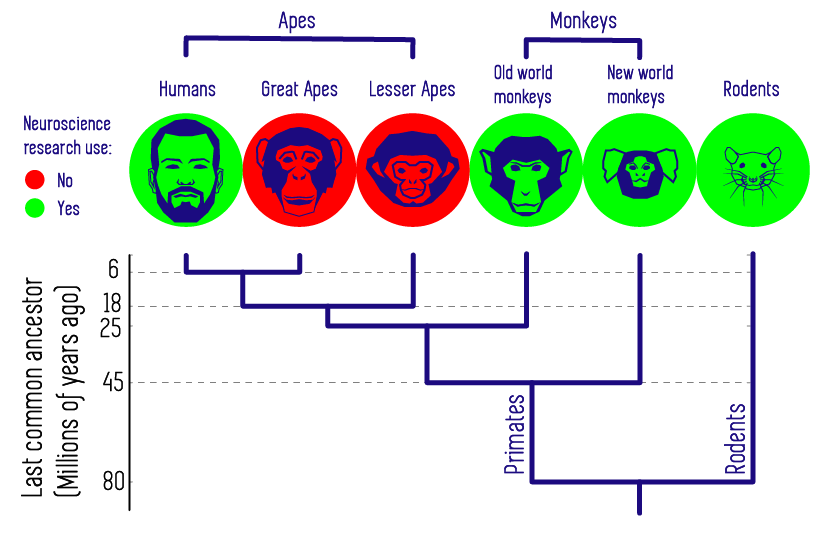
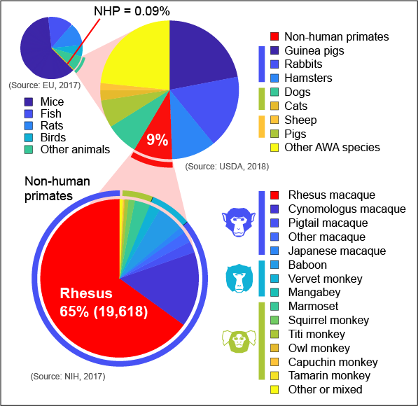
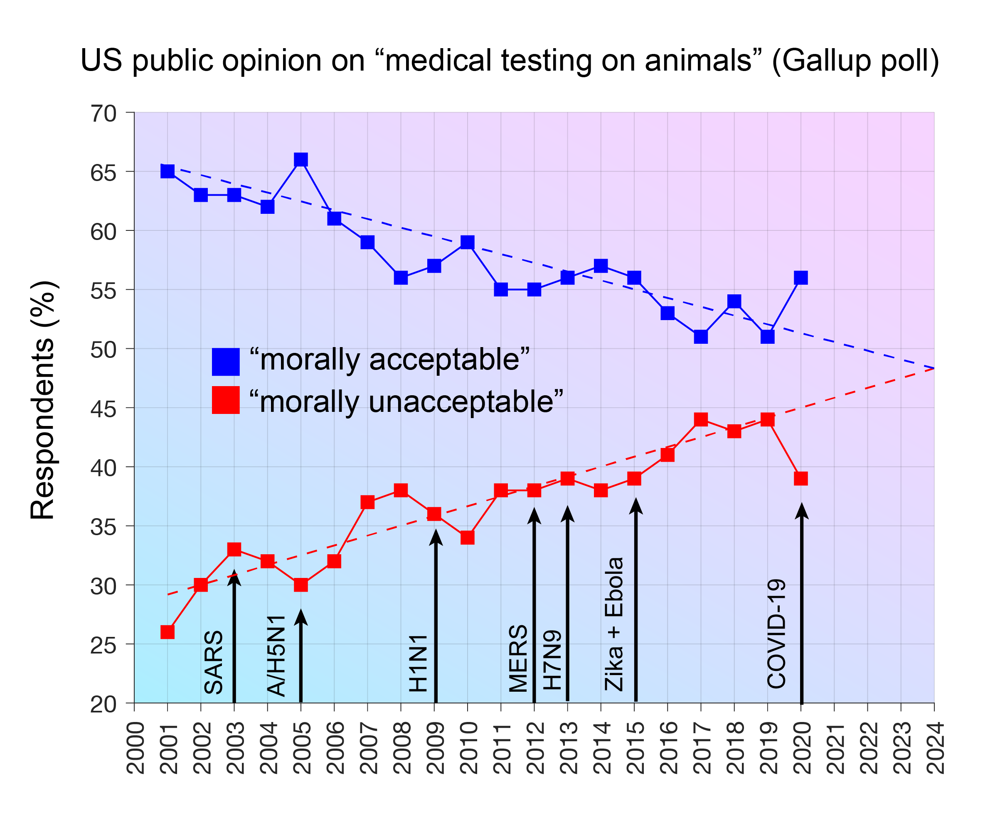
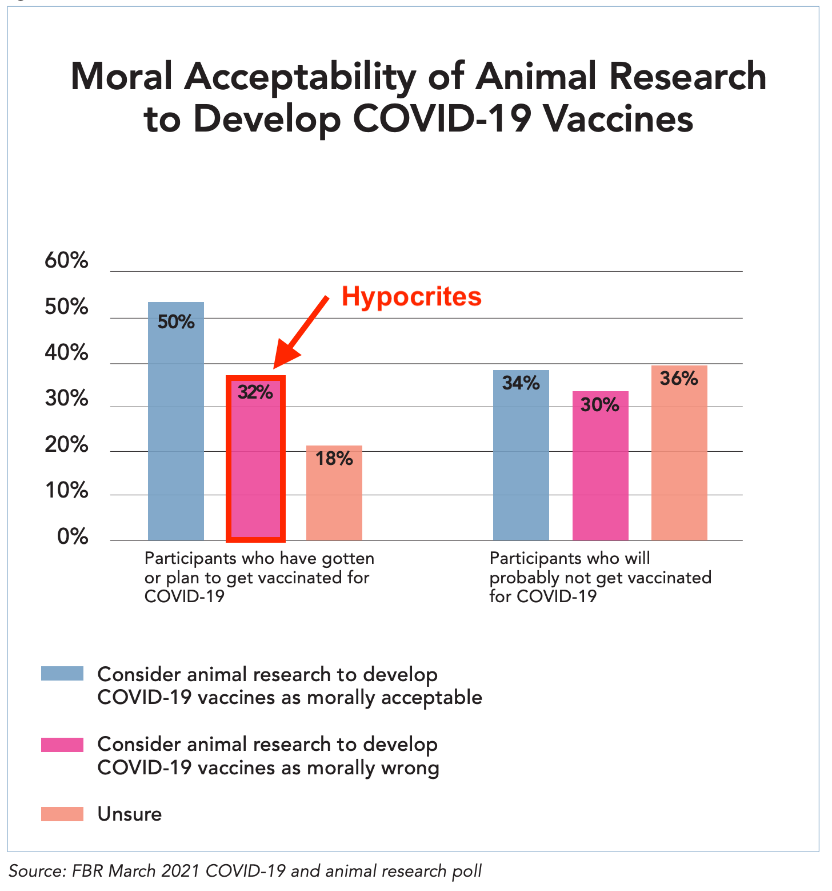

.. _animalresearch:

=================================
Animals in Biomedical Research
=================================

A central goal of biomedical research is to "seek fundamental knowledge about the nature and behavior of living systems", and to apply that knowledge to enhance health, and reduce illness and disability (`National Institutes of Health <https://www.nih.gov/about-nih/what-we-do/mission-goals>`_). `Basic research <https://en.wikipedia.org/wiki/Basic_research>`_ using animal models (i.e. 'living systems') is a critical starting point for gaining the knowledge required to achieve this mission. Scientists who work with animal models have an ethical responsibility towards those animals, which can be formalized as the concept of `the 3Rs <https://nc3rs.org.uk/3rs-public>`_: replace, reduce, refine. 

.. contents::
  :local:

Non-Human Primates in Neuroscience
======================================

Basic neuroscience research in non-human primates (NHPs) is irreplaceable for insights into cognitive functions and brain diseases that are essential for developing new treatments and therapies (`Phillips et al., 2014 <https://doi.org/10.1002/ajp.22281>`_; `Roelfsema & Treue, 2014 <https://doi.org/10.1016/j.neuron.2014.06.003>`_). This is because human and non-human primates share similar physiology, neuroanatomy, reproduction, development, cognition, and social complexity. Paradoxically, these very similarities make the use of NHPs in biomedical research an ethically considered decision. 

.. container:: clearer

    .. image :: _images/spacer.png
       :width: 1

:fa:`earth-americas` Regulation of Animal Research
======================================================

The primary regulations, policies, and guidelines that apply to animal care and use in the US and EU are listed in the table below.

.. |US| image:: _images/Icons/Flag_US.png
  :height: 15
  :class: no-scaled-link

.. |UK| image:: _images/Icons/Flag_UK.png
  :height: 15
  :class: no-scaled-link

.. tab-set::

  .. tab-item:: US |US|

    .. |USDA| image:: _images/AR/Logos/USDA.png
      :height: 40
      :target: https://www.aphis.usda.gov/aphis/ourfocus/animalwelfare

    .. |OLAW| image:: _images/AR/Logos/OLAW.png
      :height: 40
      :target: https://olaw.nih.gov/

    .. |IACUC| image:: _images/AR/Logos/IACUC.png
      :height: 40
      :target: https://www.aalas.org/iacuc

    .. |PHS| image:: _images/AR/Logos/PHS.png
      :height: 40
      :target: https://grants.nih.gov/grants/olaw/references/PHSPolicyLabAnimals.pdf

    .. |AAALAC| image:: _images/AR/Logos/AAALAC.png
      :height: 40
      :target: https://www.aaalac.org/

    .. |NIH| image:: _images/AR/Logos/NIH.png
      :height: 40
      :target: https://policymanual.nih.gov/3040-2

    .. |Guide| image:: _images/AR/Logos/Guide.png
      :height: 40
      :target: https://olaw.nih.gov/sites/default/files/Guide-for-the-Care-and-Use-of-Laboratory-Animals.pdf

    .. csv-table:: 
      :file: _static/CSVs/NA_AnimalRegulations.csv
      :header-rows: 1
      :widths: 20 20 60
      :align: left

    Additionally, the `U.S. Government Principles for the Utilization and Care of Vertebrate Animals Used in Testing, Research and Training <https://olaw.nih.gov/policies-laws/gov-principles.htm>`_ apply to animal research at NIH.

  .. tab-item:: EU |EU|

    Some info

  .. tab-item:: UK |UK|

    In the UK, animal research that can cause pain or suffering is regulated by the Animals (Scientific Procedures) Act 1986 with the Home Office as the lead government department. The law permits the use of animals in research as long as there is no alternative. Where their use is unavoidable, it requires that scientists only use the minimum number of animals and take steps to limit any pain, suffering or distress.

  .. tab-item:: China

    Chinese Association of Laboratory Animal Science
    Ministry of Science and Technology (MOST)
    China Food and Drug Administration (CFDA) 

    - Regulations for the Administration of Laboratory Animals (1988)
    - Guidelines for the Humane Treatment of Laboratory Animals (2006)

.. _CommunicatingAnimalResearch

:fa:`comments` Communicating about animal research
======================================================

.. plot:: Plot_AnimalResearchPolls.py
  :include-source: False
  :width: 300px
  :align: right

Working inside the bubble of the scientific community, many researchers may take for granted the scientific and ethical reasoning in favor of animal research. However, surveys of US adults over the last few decades have found that a growing number of respondents claim -when questioned in certain ways- to be opposed to the use of animals in scientific research. However, this picture is at odds with consumer behaviour and public demand for medical treatments that were developed from animal research, such as vaccines. Are most people just hypocrites, and living in cognitive dissonance?

Tellingly, support for animal research has historically seen increases during pandemics, when people's health is at risk, and teh importance of animal research is given more attention in the media. Similarly, support for animal research tends to be positively correlated with respondent's self-reported scientific knowledge: only ~1/3 of those with low levels of scientific knowledge support animal research, compared to nearly 2/3 of those with high levels. **This illustrates the importance of educating the public about the benefits of animal research.**

While recent polls suggest that the COVID-19 pandemic boosted public support for biomedical animal research, research by the `Foundation for Biomedical Research (2021) <https://www.nabr.org/view_file/3416/3518/9156/Public_Opinion_on_Animal_Research_in_a_Time_of_COVID-19_Poster_FINAL_BARCODE.pdf>`_ reveals that many people are conflicted or hypocritical - having accepted vaccines developed through animal research, but simultaneously claiming that this is unethical.

.. grid:: 1

  .. grid-item-card::
    :class-header: sd-bg-primary sd-text-white
    :class-body: sd-bg-secondary
    :padding: 1

    :fa:`pen` Open Letter
    ^^^^^^^^^^^^^^^^^^^^^^^^

    An open letter signed by 600 US scientists in 2018 addressed these issues:

    "Animal research plays a fundamental role in medical, veterinary and scientific progress. From the development of insulin and transplant surgery to modern day advances, including gene therapies and cancer treatments; animals – from mice to monkeys – continue to play a crucial role in both basic and applied research. Animal studies have been involved in 96 of the 108 Nobel Prizes in Physiology or Medicine. And it’s not just humans that benefit – every veterinary treatment in existence has been made possible thanks to studies in animals.

    However, such research can only continue with public support. Strict regulations and oversight reflect Americans’ desire for animals to be treated with care and respect. Furthermore, many studies – particularly those that help us understand basic biological systems – rely on public funding.

    We, the undersigned members of America’s scientific community, call upon our country’s research institutions – large and small – to embrace openness. We should proudly explain how animals are used for the advancement of science and medicine, in the interest of the health and wellbeing of humans and animals."

:fa:`link` Resources for Animal Researchers
==============================================

- `Speaking Of Research <https://speakingofresearch.com/>`_
- `Understanding Animal Research <http://www.understandinganimalresearch.org.uk/>`_
- `National Primate Research Centers <https://nprcresearch.org/primate/>`_
- `National Institutes of Health <https://grants.nih.gov/policy-and-compliance/policy-topics/air>`_
- `Americans for Medical Progress <https://www.comeseeourworld.org/animals/rhesus-monkey/>`_
- `National Center for the Replacement Refinement & Reduction of Animals in Research <https://nc3rs.org.uk/>`_
- 

:fa:`book` References
============================

`Beauchamp TL & DeGrazia D (2019). Principles of animal research ethics. Oxford University Press. <https://books.google.com/books?hl=en&lr=&id=FPDGDwAAQBAJ&oi=fnd&pg=PP1&ots=GElsIfTMCN&sig=dt_eRxNqcUCdPkgyaXri52GcpKk#v=onepage&q&f=false>`_

`Parker AJ (2020). The ethical cost of doing nothing. National Science Review <https://doi.org/10.1093/nsr/nwaa095>`_

