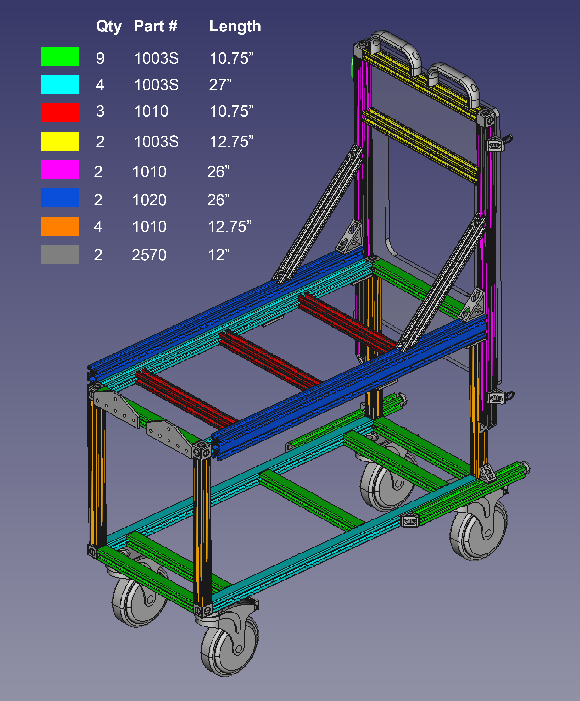
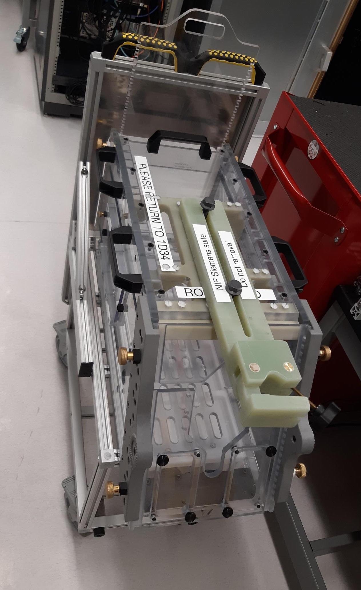

.. _NA_PrimaThrone:

=============================
PrimaThrone
=============================

PrimaThrone is an open-source `testing chair <https://www.nc3rs.org.uk/chair-restraint-training-non-human-primates>`_ design for use in :ref:`neurobehavioural research with non-human primates <animalresearch>` (NHPs). 

:fa:`circle-question` Motivation
===================================

.. grid:: 2

  .. grid-item:: 
    :columns: 4
    :margin: 0

    .. image:: _images/Designs/PrimaThrone/NA_PrimaThrone_V1.jpg
      :width: 100%
      :align: left

  .. grid-item:: 
    :margin: 0
    :columns: 8

    Neuroscientific research in NHPs requires a range of esoteric products, that manufacturers are able to charge exorbitant prices for. The NHP testing 'chair' is one such item, with each unit typically costing around :ref:`$14,000 <commercialchairs>`, while the cost of the materials is :ref:`less than $1,000 <primathrone_bom>`.

    Typical NHP chair designs (`McMillan, Bloomsmith & Prescott, 2017 <https://www.ncbi.nlm.nih.gov/pmc/articles/PMC5621573/>`_) consist of two main parts: a box structure that the animal can climb into and sit in with only the head exposed, and a base structure that is used to elevate the box and is typically on lockable casters for transportation. The main constraints on the materials and construction of NHP chairs is that they need to be able to safely and comfortably contain an adult NHP, while also withstanding the high temperature and pressure of facility cage wash systems. However, they also need to be light enough to move around fairly easily and designed with ease of use and the safety of researchers in mind. NHP chairs for use in MRI scanners places additional constraints on material choices and dimensions, which this design is not intended for.

.. _commercialchairs:

:fa:`sack-dollar` Commercial options
======================================

.. grid:: 2

  .. grid-item:: 
    :columns: 5

    If your lab has the money, it's always nice to buy ready-made solutions
    so that you can focus on science instead of engineering! The table to the right lists some
    commercial options for typical NHP behavioural testing chairs. 

  .. grid-item:: 
    :columns: 7

    .. csv-table:: 
      :file: _static/CSVs/MLab_NHPchair_Commercial.csv
      :widths: 30 20 20 20
      :header-rows: 1
      :align: left
 

:fa:`industry` Materials
============================

.. tab-set::

  .. tab-item:: Polycarbonate

    Polycarbonate (e.g. 'Lexan') is a popular choice of panel material for constructing the box section of NHP chairs, since it is available in a
    clear format that allows researchers visual access to the animal once seated in the chair. Polycarbonate panels are inexpensive and can be cut
    to custom shapes using a water-jet cutter (although they cannot be laser cut). The downside of polycarbonate is that it becomes brittle through
    repeated exposures to high-temperature cage wash systems, which combined with the mechanical forces applied to it will eventually result in
    cracks, especially around screw holes. The use of nylon or other non-metal screws and hardware, and larger through-holes (rather than
    tapped holes) can ameliorate this problem.

  .. tab-item:: Aluminium

    A more durable alternative to polycarbonate is aluminium, with the obvious trade-off that you won't be able to see through it. Using a
    marine-grade aluminium alloy like `5052 <https://en.wikipedia.org/wiki/5052_aluminium_alloy>`__ for the side panels of the chair box will improve the chair's structural stability and chemical resistance, while vent holes cut in these panels can give some visibility and improve air flow.

  .. tab-item:: T-slot profile

    Extruded aluminium 't-slot' profile is a simple and cost effective means of constructing the chair base. Many companies offering NHP chairs commercially will use t-slot, although this construction method is less durable than a welded frame, and may require re-tightening over time. A benefit of t-slot profile is that it is easy to attach additional components to the chair, such as guides to help position the chair in a stable and reproducible manner in the testing rig.

  .. tab-item:: Hardware

    In addition to the t-slot hardware and locking casters needed for the base, a hinge and latches are needed for the rear door, handles for
    moving the chair around, corner brackets for attaching the panels to each other, and a removable waste pan.

.. _primathrone_bom:

.. dropdown:: :fa:`list` Bill of materials
  :chevron: down-up
  :color: info

  .. csv-table::
    :file: _static/CSVs/MLab_PrimaThrone_BOM.csv
    :header-rows: 1
    :widths: auto
    :align: left

:fa:`screwdriver-wrench` Custom Parts
===========================================

.. grid:: 2

  .. grid-item:: 
    :columns: 8
    :margin: 0
    :padding: 0

    The design files for cutting the panels out of your selected material (e.g. plate aluminum and/or polycarbonate) are provided via the links below. 

    .. button-link:: https://grabcad.com
       :color: primary

       GrabCAD Download

  .. grid-item:: 
    :columns: 4
    :margin: 0

    .. image:: _images/Designs/PrimaThrone/PrimaThrone_V1_Demo.jpeg
      :width: 100%
      :align: right

.. _NA_PrimaThroneMRI:

:fa:`magnet` PrimaThrone MRI
===============================

.. grid:: 2

  .. grid-item:: 
    :columns: 8
    :margin: 0
    :padding: 0

    A horizontal training chair was designed as a low-cost, easy to assemble solution to allow researchers to train animals for awake fMRI outside of the scanner environment. The outer dimensions and shape of the box are similar to those of commercial horizontal fMRI chairs, but the use of commercially available extruded aluminium profile frame and off-the-shelf hardware greatly simplifies assembly, lowers cost, and speeds up construction. The panels are 3/8" polycarbonate, which can be custom cut to the required shapes (including bevel and mitre cuts) by vendors listed or possibly by your institution's machine shop (water jet cutting is recommended). The only additional custom machining required is the drilling of through-holes in the polycarbonate.

    The chair design includes the following features:

    - **Safety**

      - sliding neck plate on the front panel
      - rear drop-down door with latches for locking in both open and shut positions
      - drop-down door will not fully close without user intervention (no trapped tails!)

    - **Adjustability**

      - floor insert and drip tray, adjustable to multiple different heights
      - adjustable headpost crossbar with lever locks
      - optional response lever attachments to front panel

    - **Ease of use**

      - handles on the top of the chair frame for ease of lifting
      - removable drip tray is easy to empty

    The following bill of materials provides suggested vendors for purchasing the aluminium extrusion and hardware parts. Custom cut polycarbonate is available from various vendors suggested here:

    - `eMachineSHop <https://www.emachineshop.com/quote/>`_
    - `Big Blue Saw <https://www.bigbluesaw.com/>`_
    - `FedTech <https://www.fedtech.com/request-for-quote.html>`_

  .. grid-item:: 
    :columns: 4
    :margin: 0

    .. image:: _images/Designs/PrimaThrone/NA_MonkeyBox_front.png
      :width: 100%
      :align: right

    .. image:: _images/Designs/PrimaThrone/NA_MonkeyBox_rear.png
      :width: 100%
      :align: right

.. dropdown:: :fa:`list` Bill of materials
  :chevron: down-up
  :color: info

  .. csv-table::
    :file: _static/CSVs/NA_Hardware_HorizontalTrainingChair.csv
    :align: right
    :header-rows: 1
    :widths: auto

In order to make this design MRI-compatible, it is recommended to use `fiberglass structural profile <https://mgs4u.com/product/1-on-side-square-tube/?v=7516fd43adaa>`_ in the place of the aluminium. Since fiberglass profile is not readily available with T-slots, all screw holes would need to be drilled and tapped. However, this is a feasible approach to constructing a MRI-compatible chair with greater strength and rigidity than chairs where the polycarbonate panels are directly bolted or glued together.

:fa:`cart-flatbed` Trolley for horizontal chairs
==================================================

Trolleys for transporting horizontal NHP chairs between the animal's home room and the lab can be constructed from commercially available aluminum t-slot profile and non-magnetic parts (for use in the MRI magnet room). These carts can therefore be safely wheeled into an MRI scanner room and locked in place next to the patient bed in order to minimize the distance when transferring animals for MRI studies. This trolley design positions the chair door at the correct height for transferring animals directly into the chair from the bottom row of an `Allentown quad <https://www.allentowninc.com/large-animal-housing/primate/>`_ home cage, but can be easily modified to suit other caging systems by simply changing the height and base width (to maintain stability) of the aluminum profile.

The table below lists the components used for construction of a trolleys. However, before ordering it should be noted that assembly involves the following additional steps:

.. tab-set::

  .. tab-item:: Tapping

    .. image:: _images/Designs/PrimaThrone/Profile_tapped.jpg
      :width: 20%
      :align: right

    All T-slot aluminium profile pieces need both end holes tapped with 1/4"-20 threads (except for the 2x1 profile). This optional service can be requested from vendors like `8020 <https://8020.net>`_ at an extra cost and slight additional delay to shipping. Alternatively, this can be done by hand using the appropriate `tap <https://www.mcmaster.com/2687A48/>`_, `wrench <https://www.mcmaster.com/2546A23/>`_, and `lubricant <https://www.mcmaster.com/1413K42/>`_.

  .. tab-item:: Drilling

    The :bdg-info:`4 x 27"` long T-slot profile pieces need to have 1/4" through holes drilled through them as indicated by the red lines in the design file below. A T-slot drill jig can be purchased from `McMaster-Carr <https://www.mcmaster.com/47065T448/>`_ for use with a hand drill, but a drill press is recommended for this. A tip is to use the 2x2" t-slot plates to clamp pairs of t-slot profile together and drill 2 at a time in order to ensure good alignment of through holes.

  .. tab-item:: Waterjet

    .. image:: _images/Designs/PrimaThrone/NA_RogueTrolley_RearPanel.png
      :width: 30%
      :align: right

    The :bdg-secondary:`rear plate` is waterjet cut from 0.25" thick 5052 plate aluminium (for marine-grade corrosion resistance). This can usually be done by your institutional machine shop, or outsourced to a commercial shop like `Xometry <https://www.xometry.com/quoting/home/>`_ for faster turnaround. The digital template file (.DXF) for this part can be downloaded :download:`here <_static/CAD/PrimaThrone/RogueTrolley_InterfacePanel_V2.dxf>`.

.. button-link:: https://grabcad.com
   :color: primary

   GrabCAD Download

These customizations can alternatively be requested at the time of order from companies such such as `8020 <https://8020.net>`_ (although this will add to the `shipping time <https://8020.net/shipping-information>`_).

.. dropdown:: :fa:`list` Bill of materials
  :chevron: down-up
  :color: info

  .. csv-table::
    :file: _static/CSVs/NA_Hardware_RogueTrolley.csv
    :align: right
    :header-rows: 1
    :widths: auto

Note that the most expensive components are the non-magnetic casters. An cheaper option could be to purchase an alternative caster (such as the regular version of the same MedCaster nylon 5" locking casters: `NG-05QDP125-TL-TP01 <https://www.zoro.com/medcaster-plate-caster-swivel-5-wheel-dia-ng05qdp125tltp01/i/G8094590/>`_), and transfer the NHP chair from the transport trolley to an MR-compatible trolley before entering the magnet room if needed.

