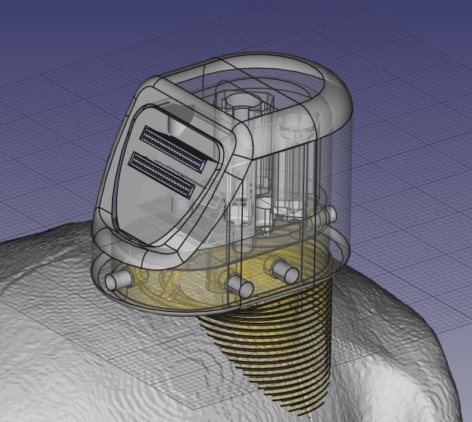
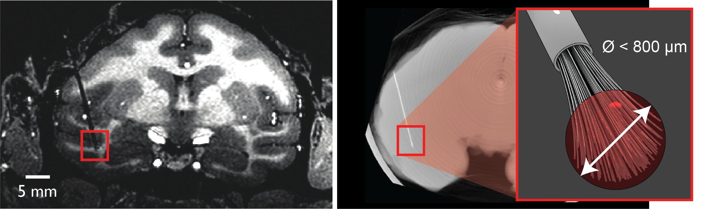
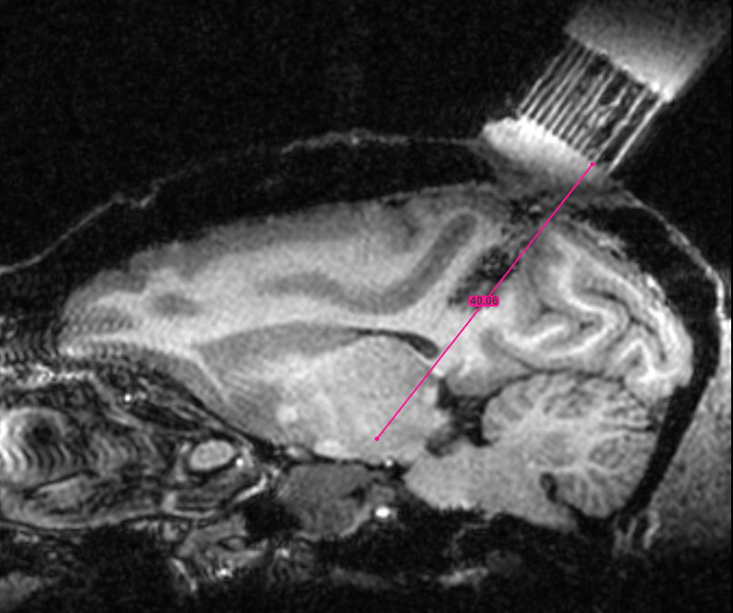
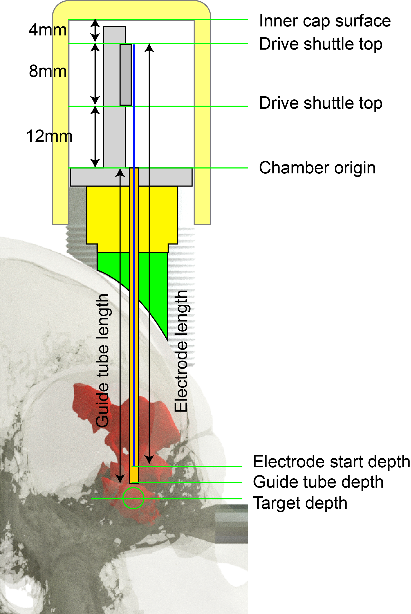

.. |HW| image:: _images/Icons/oshw_button.png
  :height: 30
  :target: https://www.oshwa.org/

.. |SW| image:: _images/Icons/osi_button.png
  :height: 30
  :target: https://opensource.org/

=====================================================================
|HW| |SW| Multidrive Implant Designer for Accurate Stereotaxy (MIDAS)
=====================================================================

MIDAS (Multi-stage Implant Designer for Accurate Stereotaxy) is a system for designing and implanting customized multi-shaft microdrives for use with chronic :ref:`microwire brush array (MBA) <mba>` electrodes. It was developed based on a combination of the Ide-McMahon (`McMahon et al., 2014 <https://www.physiology.org/doi/10.1152/jn.00052.2014>`_) and `EDDS Array Drive <https://www.microprobes.com/component/rsform/form/13-micro-electrode-array-mea-for-the-edds-microdrive?Itemid=1034>`_ systems. However, unlike previous approaches it harnesses the power open-source CAD software and 3D-printing to deliver numerous advantages:

- :badge:`Targeting accuracy,badge-primary`
  The MIDAS system divides implantation into two separate surgical procedures: first chamber implant, followed by electrode insertion. In between these two surgeries, a chamber localizer MRI scan is acquired, using MR contrast agent to visualize the chamber orientation relative to target regions. 

- :badge:`Electrode density,badge-primary`
  A small footprint allows multiple independent microdrives to be housed on the same chamber. This allows increased total channel counts by using multiple MBAs (while avoiding the pitfalls of increasing microwire counts per MBA) and additionally increases spatial sampling of target regions.

- :badge:`Surgical sterility,badge-primary`
  Since the skull remains intact during the first surgery (except for screw holes) and the craniotomies made during the second surgery are small (<3mm diameter) and inside the sealed chamber, opportunities for ingress of materials that could lead to intracranial infections are substantially reduced.

- :badge:`Ease of replacement,badge-primary`
  The MIDAS system is modular. Importantly, the electrode guide tubes are removable, thus allowing for complete replacement of currently implanted electrodes if required.

.. contents:: :local:

.. _mba:

Microwire Brush Array (MBA) Electrodes
===============================================

  Coronal MR image and micro-CT showing an implanted chronic microwire multielectrode and an illustration of the 'brush' tip (MR image courtesy of McMahon et al., 2014).

Microwire 'brush' array electrodes have been independently developed by multiple groups. However, the variety now commercially manufactured by `MicroProbes <https://microprobes.com/images/products/mc/mba/>`_ were originally developed at the University of Freiburg (`Bondar et al., 2009 <http://journals.plos.org/plosone/article?id=10.1371/journal.pone.0008222>`_; `Krüger et al., 2010 <https://doi.org/10.3389/fneng.2010.00006>`_). 

The concept is to take a bundle of insulated microwires and insert them into the brain through a guide tube. As the electrode tip is lowered, the individual wires splay out in the tissue, allowing for stable isolation of extracellular spiking activity for a local population of neurons over long time periods (many months). Each microwire consists of a nickel-chromium-aluminum core of 12.5 µm diameter, insulated with polyimide by the manufacturer (`IsaOhm®, Isabellenhüete <https://www.isabellenhuette.de/en/precision-alloys/products/isaohmr>`_, Germany). These electrodes are currently commercially available from `MicroProbes (MD) <https://microprobes.com/products/multichannel-arrays/mba>`_ in lengths from 2.5 mm to 120 mm. 

Manual Multidrive Customization in FreeCAD
===============================================

The following guide provides step-by-step instructions for manually customizing the digital model of the multidrive system in the open-source software FreeCAD. Specifically the part names are based on the version of the file :code:`Multidrive_Livingstone_V4Custom.FCStd` (July 2019).

.. link-button:: https://www.thingiverse.com/thing:3757888
    :type: url
    :text: Download CAD Files
    :classes: btn-outline-primary

.. panels:: 
  :column: col-lg-12 p-0 m-0
  :body: bg-dark text-justify text-light

    .. tab:: 1. Drill guides

      .. image:: _images/Designs/MultidriveDesigner/ChamberEditing_FreeCAD/Slide2.png
        :align: right
        :width: 100%

      - In the :badge:`DrillGuides,badge-primary` folder, select the :badge:`DrillGuideHole_1,badge-success` part
      - Update the X and Y position of the part as desired
      - Select the :badge:`DrillGuide_blank,badge-success` part
      - Hold the :badge:`Command,badge-secondary` key down and reselect the :badge:`DrillGuideHole_1,badge-success` part
      - In the :badge:`Parts,badge-warning` workbench, click the :badge:`Boolean subtraction ,badge-warning` tool icon.
      - Select the final :badge:`Cut,badge-success` part and click :badge:`File,badge-secondary` > :badge:`Export,badge-secondary` and save the grid part as a .stl file for 3D printing. 
      - Repeat this process to create a drill guide for each electrode location. You may be able to fit multiple drill guide screws (M4 vented screws)

    .. tab:: 2) Guide-tube grid

      .. image:: _images/Designs/MultidriveDesigner/ChamberEditing_FreeCAD/Slide3.png
        :align: right
        :width: 100%

      - In the :badge:`Grid,badge-primary` folder, select the :badge:`ElectrodeHole,badge-success` part
      - Update the X and Y position of the part as desired
      - Select the :badge:`Grid_blank,badge-success` part
      - Hold the :badge:`Command,badge-secondary` key down and reselect the badge:`ElectrodeHole,badge-success` part
      - In the :badge:`Parts,badge-warning` workbench, click the :badge:`Boolean subtraction, badge-danger` tool icon.
      - The product of this operation now appears as :badge:`Cut,badge-success`. Repeat this process for as many electrodes as you want.
      - Select the final Cut part and click :badge:`File,badge-secondary` > :badge:`Export,badge-secondary` and save the grid part as a .stl file for 3D printing. 

    .. tab:: 3) Drive tower positioning

      .. image:: _images/Designs/MultidriveDesigner/ChamberEditing_FreeCAD/Slide4.png
        :align: right
        :width: 100%

      - In the :badge:`DriveTower,badge-primary` folder, select all parts
      - Right click on the selected parts and copy and paste to create a new DriveTower
      - Set the view to from above
      - In the :badge:`Draft,badge-warning` workbench, select the :badge:`Move,badge-danger` tool
      - Enter the desired X and Y chamber-centered coordinates of the electrode target.
      - In the :badge:`Draft,badge-warning` workbench, select the :badge:`Rotate,badge-danger`  tool
      - Enter a suitable rotation in the XY plane so that the drive tower fits on the chamber

    .. tab:: 4) Merge drive towers

      .. image:: _images/Designs/MultidriveDesigner/ChamberEditing_FreeCAD/Slide5.png
        :align: right
        :width: 100%

      - In the :badge:`DriveTower,badge-primary` folder(s), select the :badge:`ElectrodeHole,badge-success` and :badge:`DriveWell,badge-success` parts.
      - In the :badge:`Part,badge-warning` workbench, use the :badge`Boolean add,badge-danger` tool to fuse the parts together.
      - Select the :badge:`DriveBase_Blank,badge-success` part and then the newly created Fusion part, and use the Boolean subtract tool.
      - Use the :badge:`Boolean add,badge-danger` tool to add the :badge:`DriveShaft,badge-success` parts to the :badge:`Fusion,badge-success` part.
      - Use the :badge:`Boolean add,badge-danger` tool to add the :badge:`ConnectorBlock,badge-success` part to the :badge:`Fusion,badge-success` part.
      - Export the finished drive assembly as an .stl file.

    .. tab:: 5) Merge drive caps

      .. image:: _images/Designs/MultidriveDesigner/ChamberEditing_FreeCAD/Slide6.png
        :align: right
        :width: 100%

      - In the :badge:`DriveTower,badge-primary` folder(s), select all :badge:`DriveShaftCaps,badge-success` parts
      - Apply the :badge`Boolean add,badge-danger` tool 
      - Select all :badge:`DriveShaftCapCutout,badge-success` and :badge:`DriveShaftAccessHole,badge-success` parts
      - Apply the :badge:`Boolean add,badge-danger` tool 
      - Select the first :badge:`Fusion,badge-success` part that was created in step 2, and then the second :badge`Fusion,badge-success` part that was created in step 4.
      - Apply the :badge:`Boolean subtract,badge-danger` tool.
      - Export the drive shaft caps as a .stl

3D Printing, Finishing and Assembly
================================================

Multidrive Surgical Implantation Procedure
================================================

Surgery #1: Chamber implantation
-----------------------------------

.. panels:: 
  :column: col-lg-12 p-0 m-0
  :body: bg-dark text-justify text-light

    .. tab:: 1. Place screws

      .. image:: _images/Designs/MultidriveDesigner/ChamberEditing_FreeCAD/Slide2.png
        :align: right
        :width: 100%

      - 

    .. tab:: 2. Place ground wire

    .. tab:: 3. Attach cap

.. dropdown:: Surgery 1 Tools and Materials
  :open:
  :container: + shadow
  :title: bg-primary text-light text-justify
  :body: bg-dark text-justify 

  .. csv-table::
    :file: _static/CSVs/MIDAS_Surgery1_materials.csv
    :align: left
    :header-rows: 1
    :widths: auto

.. image:: _images/Designs/MultidriveDesigner/ChamberEditing_FreeCAD/Multidrive_Surgery1_CoordinateSheet.png
  :align: right
  :width: 50%

1.Place animal in stereotax and confirm position with tooth marker

2.After sterilization and draping, open the skin with scalpel and separate the skin from muscle by blunt dissection.

3.Remove any cement that may be in the way of the surgery with dremel or drill. Clean the skull and keep moist.

4.Using the stereotaxic arm, find the X and Y position of the skull target. 

5.Use a pen to mark the location of chamber center on the skull.

6.Attach the chamber to the stereotaxic arm and lower it until it makes contact with the skull surface. Mark an outline of the chamber base against the skull and markthe desired screw locations for drilling.

7.Use hand drill and tap to place ceramic screws around the chamber.

8.Place a grounding screw near the chamber.

9.Put Quick-Stat FS on the skull and stop bleeding.

10.Put dental varnish (Copalite) on the skull 

11.Put some thin cement (or Geristore) on the skull

12.Place Chamber on the skull using stereotaxic arm. Pass the grounding gold pin through a hole of the chamber.

13.Check chamber height and angle, and cement the chamber to ceramic screws and skull

14.Solder copper wire to the grounding gold pin.

15.Attach temporary cap to chamber (and apply high vacuum grease).

16.Close up the scalp

Chamber localization MRI scan
----------------------------------

.. container:: clearer

    .. image :: _images/spacer.png
       :width: 1

Surgery #2: Electrode implantation
-----------------------------------

.. dropdown:: Surgery 2 Tools and Materials
  :open:
  :container: + shadow
  :title: bg-primary text-light text-justify
  :body: bg-dark text-justify 

  .. csv-table::
    :file: _static/CSVs/MIDAS_Surgery2_materials.csv
    :align: left
    :header-rows: 1
    :widths: auto

  .. csv-table::
    :file: _static/CSVs/MIDAS_Surgery2_tools.csv
    :align: left
    :header-rows: 1
    :widths: auto

Preparation
~~~~~~~~~~~~~~~~

1.Place animal in stereotax.

2.Remove the temporary chamber cap and clean the chamber.

3.Sterilize and drape surgical area.

Guide tube placement
~~~~~~~~~~~~~~~~~~~~~~~~~

4.Insert the custom drill guide grid into the chamber.

5.Insert the 1.5 mm drill bit through the holes of the drill guide grid and make the craniotomies.

6.Remove the drill-guide grid and inspect the craniotomies. Flush the chamber again.

7.Insert the custom electrode guide grid into the chamber.

8.Place the custom guide-tube insertion guide in place.

9.Insert the guide-tube(s) into the holes of the guide-tube insertion guideand then electrode guide grid, through the craniotomy and down to theappropriate depth for the desired target.

10.With the guide tube inserted, apply a small dab of glue where the guide tube meets the electrode guide grid.

11.Remove stylet(s) and guide tube(s) from the guide tube carefully.

12.Cut guide tube(s) just below the guide-tube insertion guide.

13.Remove the guide-tube insertion guide. 

14.Glue the grid to the chamber.

15.Fill the space below the electrode grid with Kwik-Cast silicone sealant.

16.Cut the guide tube further if necessary, so the end of guide tube all beneath the edge of microdrive assembly.

Electrode Placement
~~~~~~~~~~~~~~~~~~~~~~~~~

17.Adjust the length of electrode(s) on the microdrive so the tip ends 1 mm above the end of the guide tube.

18.Hold the microdrive assembly with microdrive holder and put on the stereotaxic arm.

19.Using surgical head loupe, lower the electrode close to the guide tube.

20.Slide the insertion sleeve down along the electrode and place into the guide tube end.

21.Lower the electrode into the guide tube, approx. 5-10 mm.

22.Slide the insertion sleeve up and detach from the electrode.

23.Put grounding wires into the hole of the microdrive assembly.

24.Lower the electrode further and place the microdrive on the chamber.

25.Screw microdrive down to the chamber.

26.Remove the microdrive holder and stereotaxic arm.

27.Fill the space at the guide tube end with Kwik-Cast silicone sealant.

28.Connect the grounding wires between the connector and gold pinusing soldering iron.

29.Connect Apollo system to the connector.

30.Using microdrive lower the electrode(s) to the target region, withchecking recording signal.

31.Place Chamber cap.
