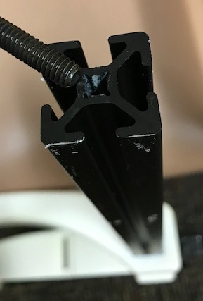
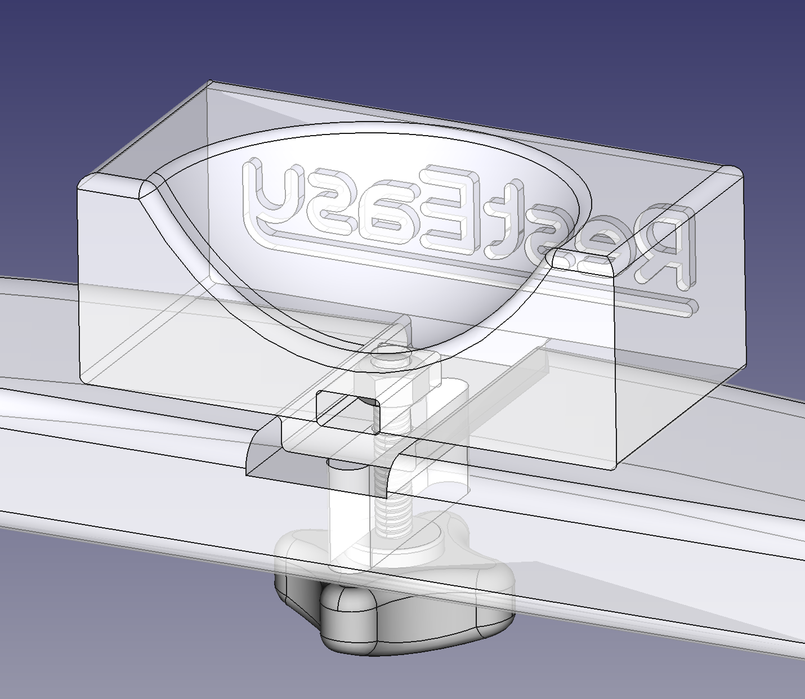
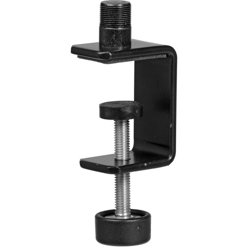

.. _NA_RestEasy:

=====================
|RestEasy|
=====================

**An open-source chin rest design for human psychophysics research.**

.. image:: _images/Icons/oshw_button.png
  :height: 30
  :target: https://www.oshwa.org/

.. image:: _images/Logos/CC.png
  :height: 30
  :target: https://creativecommons.org/licenses/by-nc-sa/4.0/

.. contents:: :local:

Summary
==========

In behavioural psychophysics experiments it is often critical for observers to maintain a stable head position in relation to the stimulus, both within and across experimental sessions. Further, behavioural performance can be significantly affected by attention and
fatigue, so it is important to ensure that observers remain as comfortable as possible throughout an experiment. However, there are few commercially available options for chin rests, and -being a specialist item- those that do exist are often costly.

.. csv-table::
  :file: _static/CSVs/MLab_RestEasy_CommercialRests.csv
  :header-rows: 1
  :widths: 30 30 20 20  
  :align: left

Fortunately, it is relatively easy to produce a chin rest of comparable strength and functionality at lower cost, without compromising aesthetics and with only minimal user assembly required. The open-source *RestEasy* design is intended for those who lack either the funds, time, or access to a machine shop to design and produce their own chin rest. All component parts can be ordered online for under $200 (depending on some options) and fall into two categories:

  **1) Commercially available components**
  These include machined, extruded, black-anodized aluminium profile, fittings, machine screws, plastic knobs, nuts and washers. These are available from many vendors worldwide, but for users based in the US, sources are listed below for `Misumi <https://us.misumi-ec.com/>`__, `8020 <https://www.8020.net/>`__, and `McMaster-Carr <https://www.mcmaster.com/>`__.

  **2) Custom designed plastic components**
  The design of the custom components was generated in the open-source CAD package `FreeCAD <https://www.freecadweb.org/>`__, and the original file is provided to allow users to make alterations to fit their specific needs. Additionally, .STL (stereolithography) files ready for immediate 3D-printing can be `downloaded <https://www.thingiverse.com/thing:2968729>`__, which can be sent to either your institution's machine shop or your nearest prototype manufacturer/ 3D-printing service (see links below) for production.

The standard version of the *RestEasy* chin rest clamps to the edge of table surfaces up to 2" thick, offers adjustable-height chin and forehead rests (up to a maximum determined by the length of aluminum profile used) and is 12" (imperial) or 24cm (metric) wide. Further variations can be created by editing the CAD file provided.

.. button-link:: https://www.thingiverse.com/thing:2968729/files
   :color: primary

   Thingiverse Download
   

Materials
============

Custom produced plastic parts
-----------------------------

There are five custom-designed parts to the RestEasy, that need to be custom manufactured in plastic. The parts can be downloaded from `Thingiverse <https://www.thingiverse.com/thing:2968729>`__ as stereolithography (.stl) files ready for 3D printing, or the `FreeCAD <https://www.freecadweb.org/>`__ (.FCStd) parametric file for further editing and export in formats suitable for CNC machining or injection molding. These plastic parts will be the most expensive components, depending on the availability of local prototyping facilities. Since they will be in contact with participants' chin and forehead, they need to be strong and comfortable against the skin. Here are some options for achieving this in ascending order of cost:

.. tab:: 3D printing

  The most straightforward and cheapest solution is to print the CAD files directly on a 3D printer. The ideal materials for this purpose are ABS, carbon-filled nylon, or PEEK, although parts in contact with subjects’ skin will benefit from finishing (sanding/ epoxy resin) to create a smooth surface over the 3D printed layers. If you do not have access to a suitable 3D printer, you can order 3D prints online from prototyping services such as those listed below. When 3D printing load-bearing parts, consider orienting them on the scanner bed such that the axes that will experience the greatest force are orthogonal to the printer's Z-axis.

  .. |USA| image:: _images/Icons/Flag_US.png
    :height: 15
    :class: no-scaled-link

  .. |UK| image:: _images/Icons/Flag_UK.png
    :height: 15
    :class: no-scaled-link

  .. |EU| image:: _images/Icons/Flag_EU.png
    :height: 15
    :class: no-scaled-link

  .. csv-table:: 
    :file: _static/CSVs/MLab_RestEasy_3Dprinting.csv
    :widths: auto
    :header-rows: 1
    :align: left

.. tab:: Cast Urethane molding

  Cast urethane has material properties similar to hard-tooled production plastics, but is quicker and cheaper than injection molding, making it ideal for low-volume production. High temperature ABS is a good option here for maximum tensile strength and a smooth black finish. The molded components of the commercially available HeadSpot are cast from GT-80R polyurethane, which is also an option.

.. tab:: Injection molding

  This process involves the production of aluminium or steel molds for each of the parts, and then injecting plastic into them. As a result, it is a more expensive and time consuming option, but it allows for the use of a wider range of resins. It is only recommended for larger batch production. 

Commercially available parts
----------------------------

**1. Aluminium profile.**
Extruded aluminium profile is easily available, it’s strong, light weight, easy to attach things to (e.g. eye tracking cameras, 3D-glasses, etc.) and is available in anodized matt black, which reduces reflections. For the purpose of the RestEasy, it is recommended to use either 1x1" or 30x30mm profile from one of the manufacturers listed below.

.. _Mlab_RestEasy_Metric:

.. _Mlab_RestEasy_Imp:

.. tab:: Metric version |EU| |UK|

  .. csv-table::
    :file: _static/CSVs/MLab_RestEasy_Metric_BOM.csv
    :widths: 10 20 50 10 10
    :header-rows: 1
    :align: left

.. tab:: Imperial version |USA|

  .. csv-table::
    :file: _static/CSVs/MLab_RestEasy_Imperial_BOM.csv
    :widths: 10 20 50 10 10
    :header-rows: 1
    :align: left

Optional Extras
---------------

+-------------+-------------+-------------+-------------+-------------+
| Manufacturer| Part #      | Description | Quantity    | Price       |
|             |             |             |             | (each)      |
+=============+=============+=============+=============+=============+
| McMaster    | `93762A100  | 1/4"        | 4           | $6.35       |
|             | <https://ww | Black-Oxide |             |             |
|             | w.mcmaster. | Steel       |             |             |
|             | com/#93762a | Sleeve      |             |             |
|             | 100/=1ddrxz | Washer      |             |             |
|             | 7>`__       |             |             |             |
+-------------+-------------+-------------+-------------+-------------+

Assembly
=========

.. _Mlab_RestEasy_Aseembly:

Finishing 3D-printed parts
--------------------------

Depending on the 3D-printing method used, some parts may have expanded or contracted. Additionally, some surfaces may have a rough laminar
structure with high friction. To ensure a good fit and minimize mechanical resistance between parts, it may therefore be necessary to
manually finish some surfaces. For smoothing surfaces or removing material, sanding and/or filing may help. All of the holes in the
plastic parts of this design are through-holes, meaning that they should be big enough for the corresponding threaded parts to pass through
easily with little friction. Check the fit of all parts before assembly and if necessary, drill the holes to enlarge them.

Part assembly
-------------

  

**1. Clamps.** 

Each of the aluminium profile pieces should have a tapped hole (1/4"-20 thread) 1.5" deep at one end. Insert this end into the
square slot on top of the plastic clamp. Insert a 1/4"-20 button head hex screw through the corresponding sized washer, and then up through
the hole in the top half of the plastic clamp and screw into the aluminum profile. Next, insert the 3/8"-16 threaded steel rod through
the hole in the lower half of the plastic clamp and through a 3/8"-16 hex nut, before screwing on one of the leveling feet. On the lower end
of the rod, attach the plastic 5-arm knob. You may wish to place a small drop of super glue around the outer surface of the 3/8"-16 hex nut, just to secure it in place, but be careful not to get any glue on the thread. Repeat this process for the other half of the stand.

  
**2. Chin rest.** 

Slide the 1/4"-20 hex nut into the small slot on the side of the chin rest cup that faces the subject. You may need to remove
any 3D-printer support materials from inside this slot before hand. You will need to jiggle the hex nut around a little until it's lined up with
the hole in the base of the chin cup. Next, line up the groove on the bottom of the chin cup with the groove on the horizontal chin rest support bar. Insert the threaded plastic 4-arm knob through the slot in the chin rest support bar and into the hole in the base of the chin rest
cup. With the hex nut lined up, screw the 4-arm knob into it.

.. image:: _images/Designs/RestEasy/WhitePrint_Crossbar.jpeg
  :width: 20%
  :align: right

**3. Side posts.** 

For each side of each horizontal support bar, insert one of the plastic 3-arm knobs through the hole on the outer side. On the inside of the post slot, screw the 3-arm knob thread loosely into a slide in T-nut. Next, insert the aluminium profile posts into the post holes, lining the T-nut up with the T-slot of the profile. Once both sides of both horizontal bars are inserted, attach the plastic end caps to the ends of the aluminium profile.

Alternative constructions
-------------------------

One modification that can reduce cost and increase strength is to use off-the-shelf table clamps designed for computer monitors or microphones (typically with 5/8"-27 threads). Clamps such as the `K&M 270 <https://www.bhphotovideo.com/c/product/534714-REG/K_M_23700_500_55_237B_Table_Clamp_Black.html>`__ and `Vivo PT-SD-CP01A <https://vivo-us.com/products/pt-sd-cp01a>`_ are sturdily constructed from steel, clamp surfaces up to 1.75" / 3.25" thick and are reasonably priced. Commercially available 5/8"-27 to 1/4"-20 adapters are available, but are typically made from softer metals that will not be strong enough to attach the T-slotted vertical posts to these clamps. We therefore recommend using a `steel adapter <https://www.amazon.com/YUNAWU-Threaded-Female-Adapter-Stainless/dp/B07DLMB3VS>`_ for this purpose.
