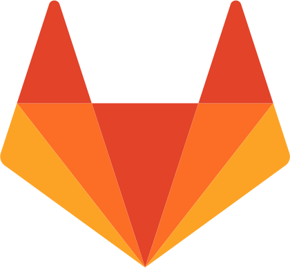

.. _NA_Software

===============================
|SW| Open Software
===============================

New Atlantis Laboratories' :link-badge:`https://opensource.org/, open software, cls=badge-success text-white` projects are hosted in publicly accessible online repositories on `GitLab <https://gitlab.com/Phenomenal-Cat>`_ and `GitHub <https://github.com/Phenomenal-Cat>`_, and licensed under the `GNU Public License v3.0 (GPL3) <https://www.gnu.org/licenses/gpl-3.0.en.html>`_ , while the accompanying documentation is hosted on `ReadTheDocs <https://newatlantis.rtfd.io>`_ and licensed under `Creative Commons CC BY-NC-SA 4.0 <https://creativecommons.org/licenses/by-nc-sa/4.0/>`_.

.. image:: _images/Icons/GitHub_Icon.png
  :height: 30
  :target: https://github.com/Phenomenal-Cat

.. image:: _images/Icons/License_GPLv3.png
  :height: 30
  :target: https://www.gnu.org/licenses/gpl-3.0.en.html

.. image:: _images/Icons/CC_logo.png
  :height: 30
  :target: https://creativecommons.org/licenses/by-nc-sa/4.0/

.. |SW| image:: _images/Icons/osi_button.png
  :height: 30
  :target: https://opensource.org/

Open Software Projects
------------------------------

.. panels::
  :column: col-lg-12 p-2 border-0
  :header: bg-secondary
  :body: bg-dark
   
  ---
  .. image:: _images/Logos/MF3D_Logo.png
    :align: left
    :height: 40
    :target: https://mf3d.readthedocs.io/

  .. image:: _images/Logos/readthedocs_Icon.png
    :height: 30
    :target: https://mf3d.readthedocs.io/
  .. image:: _images/Icons/GitHub_Icon.png
    :height: 30
    :target: https://github.com/Phenomenal-Cat/MF3D-Tools
 .. image:: _images/Logos/Python_Icon.png
    :height: 30
    :target: https://www.python.org/
  .. image:: _images/Logos/Blender_Icon.png
    :height: 30
    :target: http://www.blender.org

  ---
  .. image:: _images/Logos/Ignition.png
    :align: left
    :height: 40

  .. image:: _images/Logos/readthedocs_Icon.png
    :height: 30
    :target: https://mf3d.readthedocs.io/
  .. image:: _images/Icons/Gitlab_button.png
    :height: 30
    :target: https://gitlab.com/Phenomenal-Cat/IGNITION
 .. image:: _images/Logos/Python_Icon.png
    :height: 30
    :target: https://www.python.org/
  .. image:: _images/Logos/Slicer_Icon.png
    :height: 30
    :target: http://www.slicer.org

    

.. toctree::
   :maxdepth: 2
   :hidden:

   RestEasy - human chin rest <MLab_RestEasy_ChinRest>
   PrimaThrone - NHP chair <MLab_NHP_EphysChair>
   METHVEX - NHP head-free eye tracking <MLab_NHP_HeadMountEyeTrack.rst>