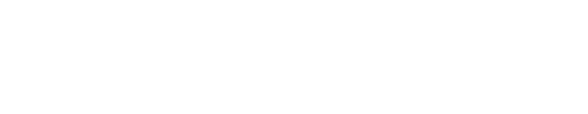

.. panels::
  :card: shadow
  :img-top-cls: p-0 
  :column: col-lg-12 p-0 border-0
  :body: bg-secondary
  :header: pl-3 pr-3 bg-primary
  
  ---
  :img-top: _images/Photos/GlassBrain_Cropcopy.png
  
  |NAL|  
  ^^^^^^^^^^^^^^^^^^^^^^^^^^^^^^^^^^^^^^^^^^^^^^^^^^^^^^^^^^

  **Open-Source Solutions for Modern Neuroscience**

  New Atlantis Laboratories produces open-source :badge:`software,badge-success` and :badge:`hardware,badge-info` with the goal of aiding the neuroscience research community. Conducting novel scientific research often requires the development of custom tools to address specific needs for which there are no commercially available solutions. Accessible, well documented, open-source solutions that permit sharing and modification provide researchers with a more developed starting points, and are therefore critical to improving research efficiency. NA Labs aims to aid the research community in such endeavors through the free and open sharing of knowledge and resources.

  .. image:: _images/Icons/Gitlab_button.png
    :width: 40
    :target: https://gitlab.com/Phenomenal-Cat

  .. image:: _images/Icons/GitHub_Icon.png
    :height: 40
    :target: https://github.com/Phenomenal-Cat

  .. image:: _images/Icons/Thingiverse.png
    :width: 40
    :target: https://www.thingiverse.com/phenomenalcat/designs

  .. image:: _images/Icons/Vimeo.png
    :width: 40
    :class: no-scaled-link

  .. image:: _images/Icons/osi_button.png
    :width: 40
    :target: https://opensource.org/

  .. image:: _images/Icons/oshw_button.png
    :width: 40
    :target: https://www.oshwa.org/

  .. image:: _images/Icons/CC_logo.png
    :width: 40
    :target: https://creativecommons.org/

  .. image:: _images/Icons/License_GPLv3.png
    :height: 40
    :target: https://www.gnu.org/licenses/gpl-3.0.en.html

.. |OS| image:: _images/Icons/osi_button.png
  :height: 30
  :target: https://opensource.org/

.. dropdown:: |OH| Open Hardware Projects
  :animate: fade-in
  :container: + shadow
  :title: bg-warning text-dark text-left font-weight-bold p-2
  :body: bg-dark text-left

  New Atlantis Laboratories' :link-badge:`https://www.oshwa.org/, open hardware, cls=badge-info text-white` projects are hosted on `Thingiverse <https://www.thingiverse.com/phenomenalcat/designs>`_ and licensed under the .

  .. panels::
    :container: container-lg pb-3
    :column: col-lg-4 col-md-4 col-sm-6 col-xs-12 p-2
    :img-top-cls: p-2 bg-primary
    :body: bg-secondary
    :footer: bg-warning

    ---
    :img-top: _images/Logos/RestEasy_w.svg

    ^^^^^^^^^^^^
    An open-source chin rest for human psychophysics research.

    +++++++
    .. image:: _images/Icons/Thingiverse.png
      :height: 30
      :target: https://www.thingiverse.com/thing:2968729/files
    .. image:: _images/Logos/readthedocs_Icon.png
      :height: 30

    ---
    :img-top: _images/Logos/RestEasy_w.svg

    ^^^^^^^^^^^^
    An open-source chin rest for human psychophysics research.

    +++++++
    .. image:: _images/Icons/Thingiverse.png
      :height: 30
      :target: https://www.thingiverse.com/thing:2968729/files
    .. image:: _images/Logos/readthedocs_Icon.png
      :height: 30

    ---
    :img-top: _images/Logos/RestEasy_w.svg

    ^^^^^^^^^^^^
    An open-source chin rest for human psychophysics research.

    +++++++
    .. image:: _images/Icons/Thingiverse.png
      :height: 30
      :align: right
      :target: https://www.thingiverse.com/thing:2968729/files

  
.. dropdown:: |OS| Open Software Projects
  :animate: fade-in
  :container: + shadow
  :title: bg-warning text-dark text-left font-weight-bold p-2
  :body: bg-dark text-left

  New Atlantis Laboratories' :link-badge:`https://opensource.org/, open software, cls=badge-success text-white` projects are hosted in publicly accessible online repositories on `GitLab <https://gitlab.com/Phenomenal-Cat>`_ and `GitHub <https://github.com/Phenomenal-Cat>`_, and licensed under the `GNU Public License (GPL3) <https://www.gnu.org/licenses/gpl-3.0.en.html>`_.
  
  .. panels::
    :container: container-lg pb-3
    :column: col-lg-4 col-md-4 col-sm-6 col-xs-12 p-2
    :img-top-cls: p-2 bg-primary
    :body: bg-secondary

    ---
    :img-top: _images/Logos/MF3D_Logo_white.svg

    ^^^^^^^^^^^^
    `MF3D Tools <https://mf3d.readthedocs.io/en/latest/>`_

    +++++++
    Tail 1

    ---

    .. image:: _images/Logos/MF3D_Logo_white.svg
      :align: left
      :height: 40
      :target: https://mf3d.readthedocs.io/en/latest/

    ---

     .. image:: _images/Logos/MF3D_Logo_white.svg
      :align: left
      :height: 40
      :target: https://mf3d.readthedocs.io/en/latest/

About
---------

.. panels::
  :column: col-lg-12 p-0 border-0
  :body: bg-secondary border-0
  :header: pl-3 pr-3 bg-primary

  .. image:: _images/Photos/SirFrancisBacon.png
    :width: 20%
    :align: right
    :class: no-scaled-link

  New Atlantis Labs takes its name from the `1626 utopian novel <https://en.wikipedia.org/wiki/New_Atlantis>`_ by Sir Francis Bacon, in which he described a fictitious island on which people held attitudes towards the free and open dissemination of knowledge that we refer to today as 'open science'.

.. toctree::
   :hidden:

   NA Hardware <NA_Hardware>
   NA Software <NA_Software>
   